  
  
  

---

## 01 / Profile

I’m Aryan Raj, an Electrical Engineering student at IIT Mandi building at the intersection of **software, intelligent systems, and real-world constraints**.

The interesting part is not making an LLM answer. It is making the whole system useful: grounded retrieval, deterministic state, clear interfaces, and a path from prototype to something people can actually use.

| BASE | CURRENT VECTOR | OUTPUT |
|:---:|:---:|:---:|
| IIT Mandi · Electrical Engineering | Python · C++ · FastAPI · Next.js · React | RAG · GenSI · LangChain |

---

## 02 / Signal console

<table>
<tr>
<td width="50%" valign="top">

<strong>Learning</strong> 
Electrical engineering, DSA, digital electronics, probability, and systems thinking.

</td>
<td width="50%" valign="top">

<strong>Building</strong> 
AI products with deterministic backends, stateful workflows, and interfaces that explain themselves.

</td>
</tr>
<tr>
<td width="50%" valign="top">

<strong>Currently around</strong> 
SnTC, Robotronics Club, CCE, Guiding and Counselling Cell, and open-source communities at IIT Mandi.

</td>
<td width="50%" valign="top">

<strong>Design rule</strong> 
Make the hard part observable. Make the useful part easy to reach.

</td>
</tr>
</table>

---

## 03 / Selected builds

<table>
<tr>
<td width="50%" valign="top">

### [ScamBait AI](https://github.com/Aryan1092raj/HoneyPot)

Selected for India AI Impact Buildathon 2026. A five-layer scam honeypot: detection, red-flag classification, deterministic state transitions, four AI personas, and intelligence extraction.

<code>Python</code> <code>FastAPI</code> <code>RAG-style pipeline</code>

</td>
<td width="50%" valign="top">

### [IIT Mandi JoSAA Chatbot](https://github.com/RemanDey/chatbot-josaa-iitmandi)

Co-developed counselling assistant grounded in official JoSAA material and delivered over WhatsApp and Telegram, with multi-provider LLM failover.

<code>Python</code> <code>Flask</code> <code>RAG</code>

</td>
</tr>
<tr>
<td width="50%" valign="top">

### [FinAgent](https://github.com/Aryan1092raj/FinAgent)

A stateful browser-based financial agent with durable task and conversation state, a FastAPI backend, PostgreSQL, and a React monitoring surface.

<code>FastAPI</code> <code>PostgreSQL</code> <code>React</code>

</td>
<td width="50%" valign="top">

### [ResQLink](https://github.com/Aryan1092raj/GoogleSolutions)

Emergency response system with a Flutter SOS app, live dashboard, Firebase sync, WebSockets, JWT, Google OAuth, and Gemini / Vertex AI incident analysis.

<code>Flutter</code> <code>Firebase</code> <code>WebSocket</code>

</td>
</tr>
<tr>
<td width="50%" valign="top">

### [GeoLedger](https://github.com/Aryan1092raj/Stellar)

Stellar charity platform with Soroban contracts for donations, NGO verification, impact escrow, tokens, NFTs, and evidence.

<code>Rust</code> <code>Stellar</code> <code>Next.js</code>

</td>
<td width="50%" valign="top">

### [Brain](https://github.com/Aryan1092raj/Daemon)

Local-first codebase intelligence using a Kuzu knowledge graph, decay scoring, hot-zone detection, BFS ripple analysis, natural-language-to-Cypher, and MCP.

<code>Node.js</code> <code>Kuzu</code> <code>MCP</code>

</td>
</tr>
</table>

<strong>Other experiments</strong>

- **Galaxy Morphology Classifier** — ResNet-18 transfer learning on the Galaxy Zoo dataset.
- **Apophis Orbital Simulation** — adaptive RK4 integration and close-approach analysis for asteroid 99942 Apophis.
- **ProjectX — LMS Team** — represented Robotronics Club at IIT Bombay Techfest and won 1st Prize at Xpecto, IIT Mandi.

---

## 04 / Experience

| When | Where | What |
|:---|:---|:---|
| Jul 2026 — Present | SnTC, IIT Mandi | Core Member |
| Jun 2026 — Jul 2026 | Centre for Continuing Education | Class Coordinator, Prayas 4.0 |
| May 2026 — Present | Robotronics Club | ProjectX LMS Team |
| Apr 2026 — Present | Guiding and Counselling Cell | Student Volunteer |
| Sep 2025 — Mar 2026 | Team Deimos Mars Rover Team | Sponsorship |

---

## 05 / Open-source trail

**GirlScript Summer of Code 2026** — ranked **1,814th globally**, top 5% of 43,587 participants, with **5 merged PRs across 4 repositories**.

- **bashmanager** — added a script-abort mechanism for runaway processes.
- **HELPDESK.AI** — fixed a voice visualizer freeze caused by a SpeechRecognition auto-pause race.
- **AlgoBuddy** — improved responsive layouts for graph visualizer and refresh pages.
- **PrepIQ** — fixed event bubbling and mock score normalization.

---

## 06 / Stack

| Area | Tools |
|:---|:---|
| Languages | Python, C++ |
| Backend | FastAPI |
| Frontend | Next.js, React |
| AI / ML | RAG, GenSI, LangChain |
| Workflow | Git, Linux, Docker, GitHub Actions, MCP |

---

## 07 / Competitive programming

 

<a href="https://codeforces.com/profile/Auxear">Codeforces profile → Auxear</a>
&nbsp; · &nbsp;
<a href="https://leetcode.com/u/Dy9h5fmpvr">LeetCode profile → Dy9h5fmpvr</a>

---

## 08 / Contribution motion

 

Regenerated automatically every day by GitHub Actions.

---

<a href="mailto:aryanraj1092@gmail.com">Let’s build something useful.</a>

  

Recursion joke: if you reached the end, you found the base case. If not, scroll up and call this README again.

  

© Aryan Raj · IIT Mandi

